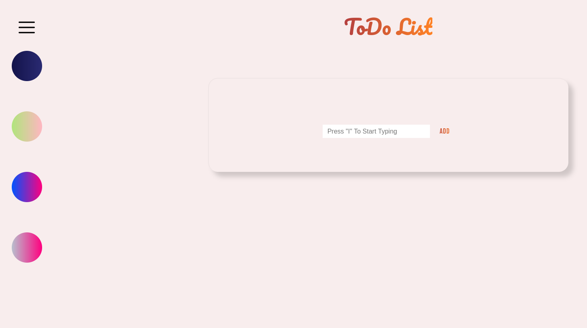
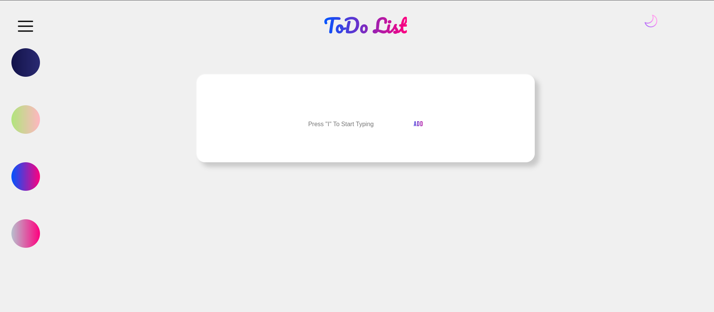
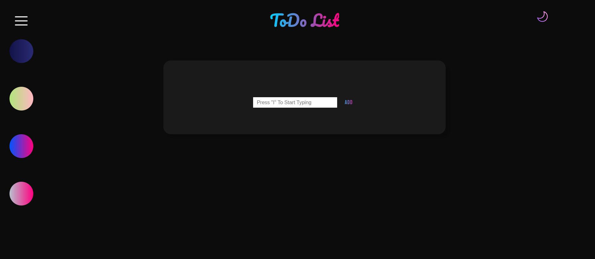

# ToDo List App 
<p align="center"><b>Welcome to the ToDo List App 📋 !</b></p>

This is a simple and elegant ToDo List application built with HTML, CSS, and JavaScript. It allows users to add, view, and manage their daily tasks with a clean and intuitive interface.

## Features

- **Add Tasks**: Easily add new tasks by typing into the input field and clicking the "Add" button.
- **Dark/Light Theme Toggle**: Switch between a light and dark theme for better accessibility and user preference.
- **Theme Customization**: Choose from multiple predefined themes to personalize your app experience.
- **Responsive Design**: The app is fully responsive and works seamlessly on devices of various sizes.
- **Task Management**: Mark tasks as completed and remove them when no longer needed.
- **LocalStorage**: Use JavaScript's LocalStorage to save the current theme and The Tasks added by the users.

## Installation

1. **Clone the Repository:**

   ```bash
   git clone https://github.com/AhmadAlaa1/todo-list-app.git
   cd todo-list-app

2. **Open index.html:**
  Simply open the index.html file in your preferred web browser.
   ```bash
   open index.html

## Usage

- **Adding Tasks:** Enter your task in the input field and click on the "Add" button to add it to the list.
- **Switching Themes:** Use the theme buttons on the navigation bar to switch between the light, dark, and other available themes.
  
  
- **Marking Tasks:** Click on a task to mark it as completed.
- **Removing Tasks:** Click the "X" button next to a task to remove it from the list.

## Project Structure
   
     ├── index.html                # Main HTML file
     ├── themes/
     │   ├── default-light-theme.css  # Light theme CSS
     │   ├── default-dark-theme.css   # Dark theme CSS
     ├── script.js                 # JavaScript file (To be implemented)
     └── README.md                 # Project documentation

## Themes
- **Default Light Theme:** A clean and minimal light theme.

  
  
- **Default Dark Theme:** A sleek dark theme for low-light environments.
  
  
  
- **Purple Light Theme** A clean and minimal purple light theme.
  
  
  
- **Purple Dark Theme** A Dark Theme With Cool Purple Colors for text and icons.
  
  
  
- **Green Light Theme** A light theme featuring cool green colors and icons, offering a fresh and vibrant look.
  
  
  
- **Night Dark Theme** A night theme with cool blue tones and a relaxing color environment, perfect for low-light settings.
  
  

## Contact
- [](https://www.linkedin.com/in/ahmad-alaa-3b4b582a4/)

